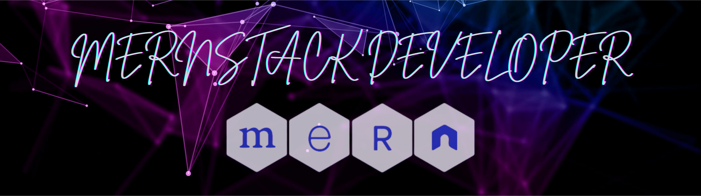

Hello, I’m Mahfuzur Rahman, a passionate full-stack developer from Bangladesh with a strong focus on crafting seamless web and mobile applications that blend robust functionality with visually captivating, pixel-perfect designs. With nearly 1.5 years of experience as a freelance developer, I specialize in the MERN stack and am adept at building dynamic, responsive, and high-performance applications.

Beside that, I’m pursuing my Bachelor’s degree in Computer Science and Engineering at North South University, Bangladesh. Beyond coding, I look forward to connect with other developers, trying to contribute to open-source projects, and expanding my expertise in full-stack development.
 

TECHNOLOGY STACK

#### Language

#### Full Stack

#### Front End

#### Back End And Database

#### Cross Platform

#### Sofrware and tools

#### Connect with me

<!---
mahfuzur-rahmannnn/mahfuzur-rahmannnn is a ✨ special ✨ repository because its `README.md` (this file) appears on your GitHub profile.
You can click the Preview link to take a look at your changes.
--->
